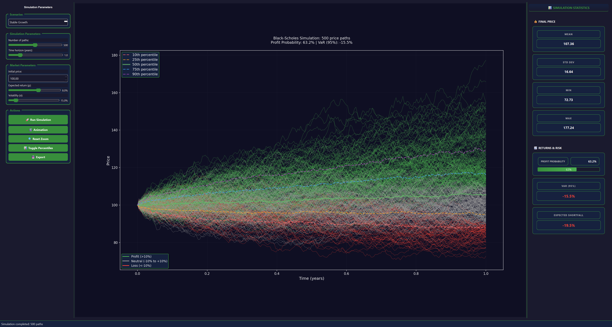
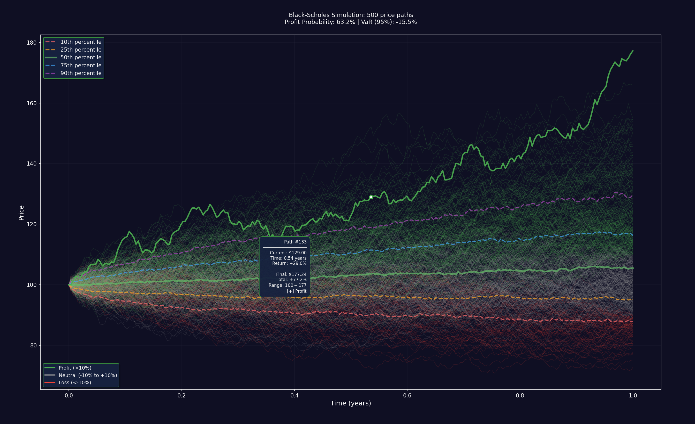

# Black-Scholes Price Movement Simulator

A simulation tool for visualizing stock price paths using the Black-Scholes model with an intuitive dark-themed interface.



## Features

🎯 **Monte Carlo Simulation** - Generate hundreds of random price paths
📊 **Black-Scholes Model** - Geometric Brownian Motion with configurable parameters
🌈 **Fan Chart Visualization** - Color-coded paths from green (profit) to red (loss)
🖱️ **Interactive Charts** - Zoom, pan, hover tooltips, and animations
⚙️ **Control Panel** - Easy parameter configuration with preset scenarios
📈 **Statistics Dashboard** - VaR, Expected Shortfall, probability metrics
🌙 **Professional Dark Theme** - Modern, eye-friendly interface

## Quick Start

### Requirements
- Python 3.10+
- pip package manager

### Installation

1. **Download the project**
```bash
git clone <repository-url>
cd black-scholes-viz
```

2. **Install dependencies**
```bash
pip install -r requirements.txt
```

3. **Run the application**
```bash
python main.py
```

## Usage Guide

### Control Panel (Left Side)
- **Scenarios**: Choose from predefined market scenarios
- **Number of paths**: Set simulation count (10-1000)
- **Time horizon**: Simulation period in years (0.1-5.0)
- **Initial price (S₀)**: Starting stock price
- **Expected return (μ)**: Annual return rate (-50% to +50%)
- **Volatility (σ)**: Market volatility (5% to 100%)

### Chart Area (Center)
- **Price paths**: Color-coded by performance (green=profit, red=loss)
- **Percentile lines**: Show distribution quantiles (10%, 25%, 50%, 75%, 90%)
- **Interactive features**: Mouse scroll to zoom, click-drag to pan
- **Hover tooltips**: Path information on mouse hover



### Statistics Panel (Right Side)
- **Final Price Statistics**: Mean, standard deviation, min/max values
- **Returns & Risk Metrics**: Profit probability, VaR (95%), Expected Shortfall
- **Visual Cards**: Color-coded positive/negative indicators

### Action Buttons
- **🎯 Run Simulation**: Execute Monte Carlo simulation
- **🎬 Animation**: Animated path visualization
- **🔄 Reset Zoom**: Return to default chart view
- **📊 Toggle Percentiles**: Show/hide percentile lines
- **📤 Export**: Save charts and data

## Preset Scenarios

| Scenario | Expected Return (μ) | Volatility (σ) | Description |
|----------|-------------------|---------------|-------------|
| **Stable Growth** | 8% | 15% | Conservative growth |
| **High Volatility** | 5% | 40% | Unstable market |
| **Bear Market** | -10% | 25% | Market decline |
| **Bull Market** | 15% | 20% | Strong growth |
| **Crisis** | -20% | 60% | Market crash |
| **Low Vol** | 6% | 8% | Stable conditions |

## Mathematical Model

The application implements the Black-Scholes model based on Geometric Brownian Motion:

```
dS(t) = μS(t)dt + σS(t)dW(t)
```

**Where:**
- **S(t)** = Stock price at time t
- **μ** = Drift (expected return rate)
- **σ** = Volatility
- **W(t)** = Wiener process (Brownian motion)

**Discrete solution:**
```
S(t) = S₀ * exp((μ - σ²/2)t + σ√dt * Z)
```
where Z ~ N(0,1) is a standard normal random variable.

## Technology Stack

- **PySide6** - Modern Qt-based GUI framework
- **NumPy** - High-performance numerical computations
- **Matplotlib** - Professional chart visualization
- **Python 3.10+** - Core programming language

## Performance Features

- **Vectorized Calculations** - Efficient NumPy operations for large simulations
- **Memory Management** - Automatic cleanup of old data
- **Background Processing** - Non-blocking simulations using QThread
- **Optimized Rendering** - Smart chart updates and hover detection

## Requirements.txt

```
PySide6>=6.0.0
numpy>=1.20.0
matplotlib>=3.5.0
pandas>=1.3.0
```